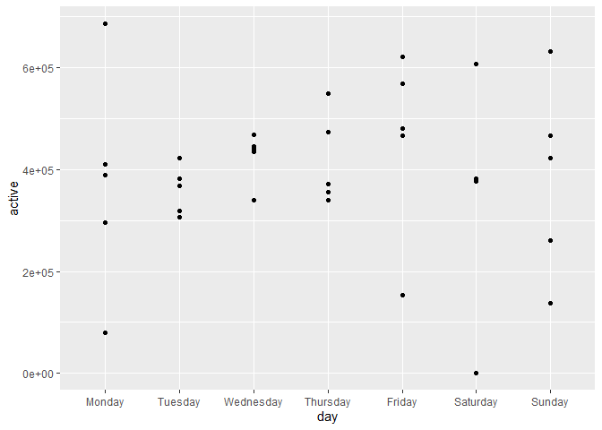

HW3
================

Problem 1 Descibing the data set

``` r
library(p8105.datasets)
data("instacart")
aisles <- instacart %>%
  select(aisle_id) %>%
  unique() %>%
  nrow() 

skimr::skim(instacart)
```

    ## Skim summary statistics
    ##  n obs: 1384617 
    ##  n variables: 15 
    ## 
    ## -- Variable type:character ---------------------------------------------------------------------------------------------
    ##      variable missing complete       n min max empty n_unique
    ##         aisle       0  1384617 1384617   3  29     0      134
    ##    department       0  1384617 1384617   4  15     0       21
    ##      eval_set       0  1384617 1384617   5   5     0        1
    ##  product_name       0  1384617 1384617   3 159     0    39123
    ## 
    ## -- Variable type:integer -----------------------------------------------------------------------------------------------
    ##                variable missing complete       n       mean        sd p0
    ##       add_to_cart_order       0  1384617 1384617       8.76      7.42  1
    ##                aisle_id       0  1384617 1384617      71.3      38.1   1
    ##  days_since_prior_order       0  1384617 1384617      17.07     10.43  0
    ##           department_id       0  1384617 1384617       9.84      6.29  1
    ##               order_dow       0  1384617 1384617       2.7       2.17  0
    ##       order_hour_of_day       0  1384617 1384617      13.58      4.24  0
    ##                order_id       0  1384617 1384617 1706297.62 989732.65  1
    ##            order_number       0  1384617 1384617      17.09     16.61  4
    ##              product_id       0  1384617 1384617   25556.24  14121.27  1
    ##               reordered       0  1384617 1384617       0.6       0.49  0
    ##                 user_id       0  1384617 1384617   1e+05     59487.15  1
    ##     p25     p50     p75    p100     hist
    ##       3       7      12      80 <U+2587><U+2583><U+2581><U+2581><U+2581><U+2581><U+2581><U+2581>
    ##      31      83     107     134 <U+2583><U+2587><U+2583><U+2583><U+2587><U+2585><U+2585><U+2586>
    ##       7      15      30      30 <U+2582><U+2585><U+2583><U+2583><U+2581><U+2582><U+2581><U+2587>
    ##       4       8      16      21 <U+2583><U+2587><U+2582><U+2581><U+2582><U+2586><U+2581><U+2583>
    ##       1       3       5       6 <U+2587><U+2585><U+2583><U+2583><U+2581><U+2583><U+2585><U+2585>
    ##      10      14      17      23 <U+2581><U+2581><U+2583><U+2587><U+2587><U+2587><U+2585><U+2582>
    ##  843370 1701880 2568023 3421070 <U+2587><U+2587><U+2587><U+2587><U+2587><U+2587><U+2587><U+2587>
    ##       6      11      21     100 <U+2587><U+2582><U+2581><U+2581><U+2581><U+2581><U+2581><U+2581>
    ##   13380   25298   37940   49688 <U+2586><U+2586><U+2587><U+2587><U+2587><U+2586><U+2587><U+2587>
    ##       0       1       1       1 <U+2586><U+2581><U+2581><U+2581><U+2581><U+2581><U+2581><U+2587>
    ##   51732   1e+05  154959  206209 <U+2587><U+2587><U+2587><U+2587><U+2587><U+2587><U+2587><U+2587>

``` r
pop_aisle <- instacart %>%
 group_by(aisle_id) %>%
  summarize(
    items = n()
   )

most <- pop_aisle %>%
  filter(items == max(items))
```

This data set has 1384617 rows with 13 different variable names. There are 0 missing data. We can see from the skimr that the peak order hours are normally distributed around the middle of the day, and most orders occur on the beginning and end of the week. There are 134 individual isles. The aisle with the most products is aisle 83 with 150609 different items.

``` r
aisless <- instacart %>%
  group_by(aisle) %>%
  summarize(
    items = n()
  ) %>%
  filter(items > 10000) %>%
  ggplot(aes(x = aisle, y = items)) +
      geom_point() + 
       ylim(0,140000) +
       theme(axis.text.x = element_text(size = 7, angle = 45, hjust = 1))
  
  
  
 # summarize(prod_count = count("product_name")) %>%
  #filter(prod_count > 10000) %>%
  #ggplot(aes( x = aisle, y = product_name)) +
   #        geom_point() +
    #       theme(legend.position = "bottom")
```

Finding the most popular items in specified aisles

``` r
pop_item <- instacart %>%
  select(product_name, aisle) %>%
  filter(aisle == c("baking ingredients", "dog food care", "packaged vegetables fruits" )) %>%
  #mutate(product_name = as_factor(product_name)) %>%
  group_by(aisle, product_name) %>%
  summarize(prods = n()) %>%
  pivot_wider(
    names_from = aisle,
    values_from = prods
  ) %>%
  summarize(maxes = max(product_name))
 #STILL NEED MAX VALUES
```

Mean hour of the day

``` r
days = c("Saturday", "Sunday", "Monday", "Tuesday", "Wednesday", "Thursday", "Friday")

means <- instacart %>%
  select(product_name, order_hour_of_day, order_dow) %>%
  filter(product_name == c("Pink Lady Apples", "Coffee Ice Cream")) %>%
 # mutate(
  #  order_dow = replace(order_dow, order_dow == days )
 # ) %>%
  group_by(order_dow, product_name) %>%
  summarize(
    hour_peak = mean(order_hour_of_day)) %>%
  pivot_wider(
    names_from = product_name,
    values_from = hour_peak
  ) 
```

    ## Warning in product_name == c("Pink Lady Apples", "Coffee Ice Cream"):
    ## longer object length is not a multiple of shorter object length

``` r
##NEED TO REPLACE DAYS    
```

Question 2
----------

Part 1

``` r
data("brfss_smart2010")
brfss <- brfss_smart2010 %>%
   janitor::clean_names() %>%
   filter(topic == "Overall Health") %>%
   mutate(response = as.factor(response)) %>%
   mutate(response = factor(response,
     levels(response)[c(4,2,3,5,1)]))

states_2002 <- brfss %>%
  filter(year == 2002) %>%
  group_by(locationabbr) %>%
  distinct(locationdesc) %>%
  summarize(n = n()) %>%
  filter(n >= 7)

states_2010 <- brfss %>%
  filter(year == 2010) %>%
  group_by(locationabbr) %>%
  distinct(locationdesc) %>%
  summarize(n = n()) %>%
  filter(n >= 7)
```

These states listed below have more than seven locations in 2002: CT, FL, MA, NC, NJ, PA and in 2010 these states had more than seven locations: CA, CO, FL, MA, MD, NC, NE, NJ, NY, OH, PA, SC, TX, WA

Part 2

``` r
brfss %>%
  filter(response == "Excellent") %>%
  group_by(year, locationabbr) %>%
  summarize(dat = mean(data_value)) %>%
  ggplot(aes(x = year, y = dat, color = locationabbr)) +
     geom_line()
```

    ## Warning: Removed 3 rows containing missing values (geom_path).


A two panel plot

``` r
brfss %>%
  filter(year == c(2006,2010)) %>%
  filter(locationabbr == "NY") %>%
  ggplot(aes(x = response, y = data_value)) +
  geom_violin(aes(fill = response), color = "blue", alpha = .5) +
  stat_summary(fun.y = median, geom = "point", color = "blue", size = 4) +
  facet_grid(. ~ year)
```

    ## Warning in year == c(2006, 2010): longer object length is not a multiple of
    ## shorter object length


Question 3

``` r
accel <- read_csv("./accel_data.csv") %>%
  janitor::clean_names() %>%
  pivot_longer(
    activity_1:activity_1440,
    names_to = "activity",
    values_to = "activity_counts",
    names_prefix = "activity_"
  ) %>%
    mutate(day = as_factor(day))  %>%
    mutate(day = factor(day,
      levels(day)[c(2,6,7,5,1,3,4)])) %>%
    mutate(end_1 = ifelse(day == ("Sunday") | day == ("Saturday"), 1,  0)) 
```

    ## Parsed with column specification:
    ## cols(
    ##   .default = col_double(),
    ##   day = col_character()
    ## )

    ## See spec(...) for full column specifications.

``` r
levels(accel$day)
```

    ## [1] "Monday"    "Tuesday"   "Wednesday" "Thursday"  "Friday"    "Saturday" 
    ## [7] "Sunday"

``` r
table(accel$day)
```

    ## 
    ##    Monday   Tuesday Wednesday  Thursday    Friday  Saturday    Sunday 
    ##      7200      7200      7200      7200      7200      7200      7200

``` r
names(accel)
```

    ## [1] "week"            "day_id"          "day"             "activity"       
    ## [5] "activity_counts" "end_1"

``` r
str(accel)
```

    ## Classes 'tbl_df', 'tbl' and 'data.frame':    50400 obs. of  6 variables:
    ##  $ week           : num  1 1 1 1 1 1 1 1 1 1 ...
    ##  $ day_id         : num  1 1 1 1 1 1 1 1 1 1 ...
    ##  $ day            : Factor w/ 7 levels "Monday","Tuesday",..: 5 5 5 5 5 5 5 5 5 5 ...
    ##  $ activity       : chr  "1" "2" "3" "4" ...
    ##  $ activity_counts: num  88.4 82.2 64.4 70 75 ...
    ##  $ end_1          : num  0 0 0 0 0 0 0 0 0 0 ...

At this point we have 6 different variables week, day\_id, day, activity, activity\_counts, end\_1 There doesn't seem to be a reason to change the variable types (besides day) in the data frame: week, day\_id, activity\_counts, and end\_1 are all numeric while activity is character, and day is a factor. There are 50400 observations.

Part 2

``` r
accel_day <- accel %>%
  select(day_id, day, activity_counts) %>%
  group_by(day, day_id) %>%
  summarize(active = mean(activity_counts))
```

There seems to be a trend towards low activity on Mondays, and the weekdays in general, while the most activity occurs on the weekends including Friday. We can plot this to see a better trend.

``` r
accel_day %>%
  ggplot(aes(x = day, y = active)) + 
  geom_point()
```

 From this, we can see that Monday and Sunday have the most variability, while there is a general trend increase in activity thoughout the week.

Plotting a 24-hr window

``` r
plots <- accel %>%
  select(day_id, day, activity_counts, activity) %>%
  group_by(day, day_id) %>%
  mutate(
    activity = as.double(activity),
  hour1 = ifelse(activity == 1:60, 1, 0),
  hour2 = ifelse(activity == 61:120, 1, 0),
  hour3 = ifelse(activity == 121:180, 1, 0),
  hour4 = ifelse(activity == 181:240, 1, 0),
  hour5 = ifelse(activity == 241:300, 1, 0),
  hour6 = ifelse(activity == 301:360, 1, 0),
  hour7 = ifelse(activity == 361:420, 1, 0),
  hour8 = ifelse(activity == 421:480, 1, 0),
  hour9 = ifelse(activity == 481:540, 1, 0),
  hour10 = ifelse(activity == 541:600, 1, 0),
  hour11 = ifelse(activity == 601:660, 1, 0),
  hour12 = ifelse(activity == 661:720, 1, 0),
  hour13 = ifelse(activity == 721:780, 1, 0),
  hour14 = ifelse(activity == 781:840, 1, 0),
  hour15 = ifelse(activity == 841:900, 1, 0),
  hour16 = ifelse(activity == 901:960, 1, 0),
  hour17 = ifelse(activity == 961:1020, 1, 0),
  hour18 = ifelse(activity == 1021:1080, 1, 0),
  hour19 = ifelse(activity == 1081:1140, 1, 0),
  hour20 = ifelse(activity == 1141:1200, 1, 0),
  hour21 = ifelse(activity == 1201:1260, 1, 0),
  hour22 = ifelse(activity == 1321:1380, 1, 0),
  hour23 = ifelse(activity == 1381:1440, 1, 0),
  hour24 = ifelse(activity == 1441:1500, 1, 0)
  ) %>%
  pivot_longer(
    hour1:hour24,
    names_to = "hour",
    values_to = "activitys"
  ) %>%
  group_by(hour)
  # ggplot(aes(x = , y = activity_counts)) +
  #geom_point()
```
